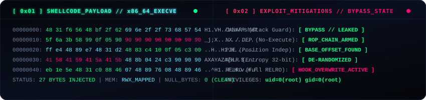
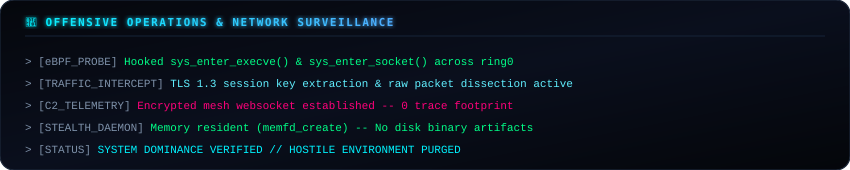

<div align="center">

<!-- Master Cyber Header Banner -->


<!-- Dynamic Animated Terminal Typewriter -->
<a href="https://github.com/gravixrdp">
  
</a>

<br/>

<!-- System Telemetry Badges -->
<p align="center">
  
  
  
  
</p>

</div>

---

### 🌐 System HUD & Real-Time Kernel Subsystem

<div align="center">
  
</div>

---

### 🧬 Shellcode Injection & Mitigation Matrix

<div align="center">
  
</div>

---

### 📡 Offensive Reconnaissance & eBPF Telemetry

<div align="center">
  
</div>

---

### ⚔️ Cyber Weaponry & Operational Stack

<div align="center">
  
  
  <br/><br/>

  <a href="https://skillicons.dev">
    
  </a>
</div>

---

### 🔬 Interactive GDB Disassembly & Memory Probe

```ansi
root@gravix:~# gdb -q ./apex_subsystem
Reading symbols from ./apex_subsystem... done.
(gdb) break *0x0000000000401080
Breakpoint 1 at 0x401080: file core.c, line 42.
(gdb) run
Starting program: /root/apex_subsystem 

Breakpoint 1, 0x0000000000401080 in sys_exploit ()
(gdb) x/8i $rip
=> 0x401080 <sys_exploit>:      xor    rax, rax
   0x401083 <sys_exploit+3>:    push   rax
   0x401084 <sys_exploit+4>:    movabs rbx, 0x68732f2f6e69622f
   0x40108e <sys_exploit+14>:   push   rbx
   0x40108f <sys_exploit+15>:   mov    rdi, rsp
   0x401092 <sys_exploit+18>:   push   rax
   0x401093 <sys_exploit+19>:   mov    rdx, rsp
   0x401096 <sys_exploit+22>:   mov    al, 0x3b
(gdb) c
Continuing.
[+] Privilege Escalation Complete: uid=0(root) gid=0(root)
[+] Daemon detached into memory. Zero disk footprint.
```

---

<div align="center">
  
</div>
