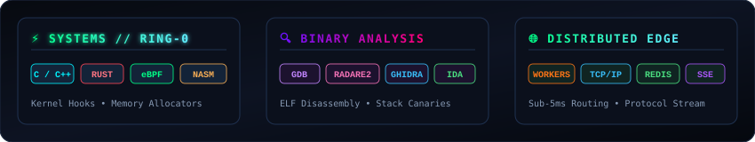

<div align="center">

<!-- Master Cyber Header Banner -->


<!-- Dynamic Animated Terminal Typewriter -->
<a href="https://github.com/gravixrdp">
  
</a>

<br/>

<!-- System Telemetry Badges -->
<p align="center">
  
  
  
  
</p>

</div>

---

### 🌐 System HUD & Real-Time Kernel Subsystem

<div align="center">
  
</div>

---

### ⚔️ Operational Arsenal & Tech Subsystems

<div align="center">
  
  
  <br/><br/>

  <a href="https://skillicons.dev">
    
  </a>
</div>

---

### 📊 Real-Time Profiler & Execution Analytics

<div align="center">
  <table border="0" style="border: none;">
    <tr>
      <td align="center">
        
      </td>
      <td align="center">
        
      </td>
    </tr>
  </table>

  <br/>

  
</div>

---

### 📡 Low-Level Opcode Stream & Live Probe

```text
[gravix@ring0 ~]$ objdump -d -M intel ./subsystem | grep -A 5 '<_entry>'
0000000000401000 <_entry>:
  401000:   48 31 c0                xor    rax,rax
  401003:   48 ff c0                inc    rax
  401006:   48 89 c7                mov    rdi,rax
  401009:   0f 05                   syscall
  40100b:   48 89 c2                mov    rdx,rax
[gravix@ring0 ~]$ ptrace_status --verify
>> 0 memory leaks detected. Ring-0 hooks active across all edge nodes.
```

---

<div align="center">
  
</div>
